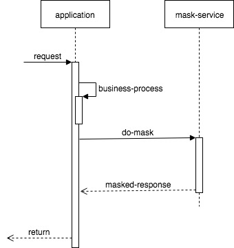

# 脱敏--配置版

## introduction
在本系列的前一篇文章中，我介绍了一个注解版的脱敏工具包。基本可以符合一般的需求场景,
胆还是存在一些不足：
- 不支持脱敏范围变化：比如需要在接口中增加或移除新字段的脱敏
- 不支持脱敏策略变化：比如手机号`134****8899`改为`1343345****`
任何上述的修改都需要修改代码，并且重新发布。
在这篇文章中，我将介绍配置版的脱敏工具，以解决上述两个问题。

## 关键概念
### mask-resource：哪些接口需要脱敏
mask-resource 代表一个api接口的相关脱敏配置信息。由 appid + url + httpmethod 唯一识别。包含各个mask-item。
### mask-item
- 需要脱敏的数据项（哪些字段需要脱敏）
- 数据项对应的脱敏策略（如何脱敏）
- 白名单（对哪些人不脱敏）

## design
### version 1

如上所示，将脱敏抽取成一个独立的服务，用于配置脱敏相关的信息，以及处理脱敏事务。每当用户请求应用接口时，都会调用脱敏接口对response做后置处理。

### version2
对于所有的api调用都请求mask-service是比较浪费的事情，所以们可以对接口加标记（比如`@UseMask`），调用脱敏服务时进行标记校验。

## implement
先上代码：
```java
public class MaskResource {
    private String appId;
    private String[] paths;
    private String[] methods;

    public String getAppId() {
        return appId;
    }

    public void setAppId(String appId) {
        this.appId = appId;
    }

    public String getCode() {
        return ResourceCodeGenerator.generateCode(paths, methods);
    }


    public String[] getPaths() {
        return paths;
    }

    public void setPaths(String[] paths) {
        this.paths = paths;
    }

    public String[] getMethods() {
        return methods;
    }

    public void setMethods(String[] methods) {
        this.methods = methods;
    }
}

public interface MaskItem {

    String getJsonPath();

    int getFrom();

    int getTo();

    boolean isAccountExcluded(String account);

}
```
- 我们用appid + paths + methods 代表一个mask-resource, 并且由此生成一个resource-code.
- 每次请求的时候通过resource-code查询对应的mask-item(多个)
- mask-item中用json-path代表要脱敏的数据项，(from,to)代表脱敏的位置，isAccountExcluded() 判断当前用户是否在白名单


